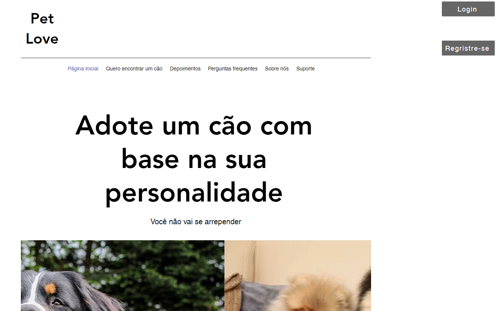
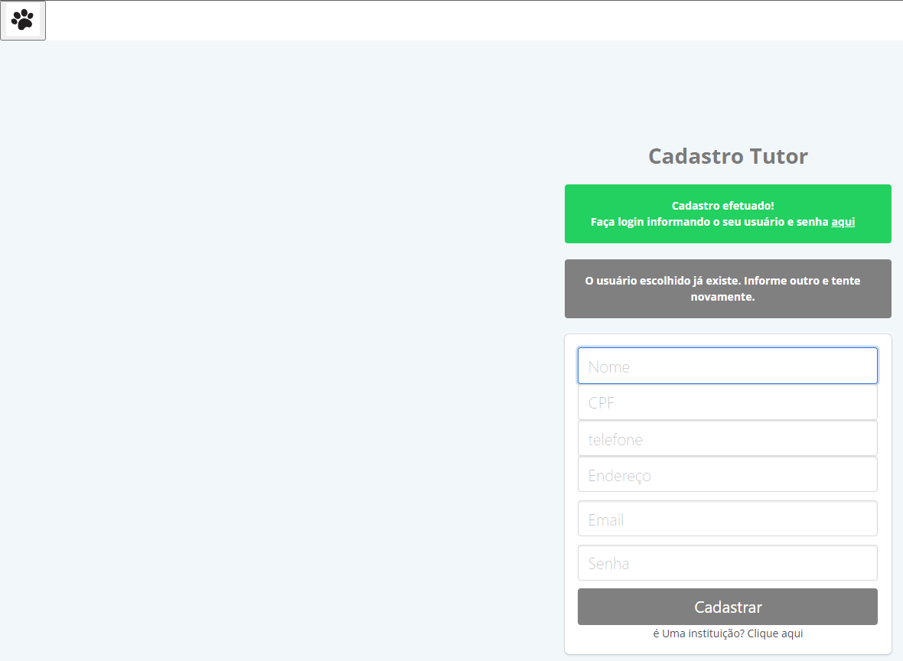

# Projeto de Interface

Pré-requisitos: <a href="2-Especificação do Projeto.md"> Documentação de Especificação</a>

Visão geral da interação do usuário pelas telas do sistema e protótipo interativo das telas com as funcionalidades que fazem parte do sistema (wireframes).

 Apresente as principais interfaces da plataforma. Discuta como ela foi elaborada de forma a atender os requisitos funcionais, não funcionais e histórias de usuário abordados nas <a href="2-Especificação do Projeto.md"> Documentação de Especificação</a>.

## Página Inicial

Pagina inicial com todas as opções clicaveis na barra de navegação na parte de cima. 
Possui 2 botões no canto superior esquedo, sendo um de Login e um de Cadastro para os usuarios e Ong's que utilizarão o Site

## Páginas de Login

Paginas de logins e registro separadas, entre login e registro de Tutores de cães e login e registro de Ong's que realizarão o cadastro dos cães que serão disponibilizados. 

  

Paginas de login e registro de Ong's 

  

## Página de Acompanhamento 

Depois de escolher o cão o tutor sera direcionado para escolher o seu cão e finalizar sua adoção 

