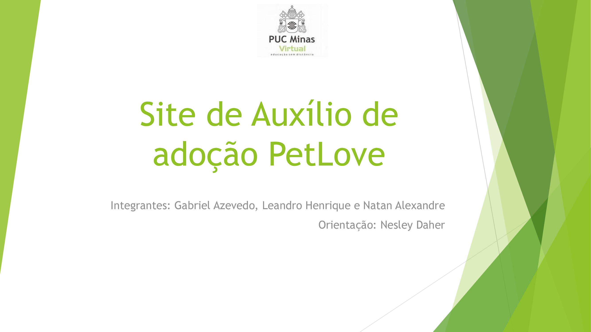
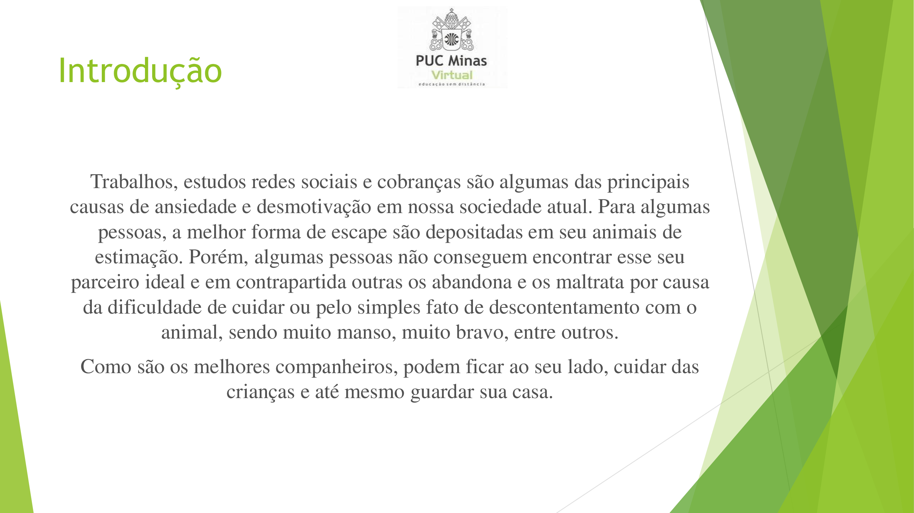
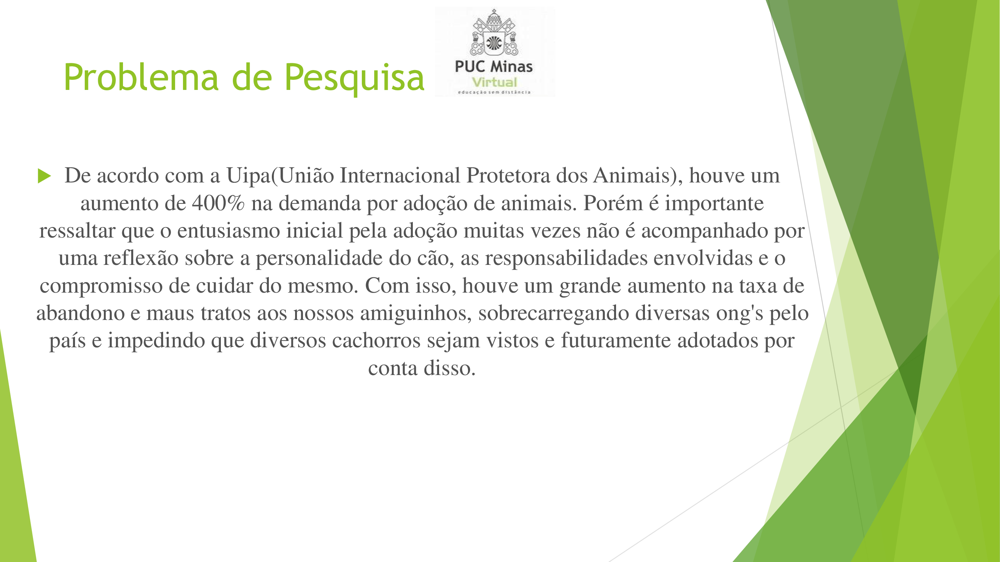
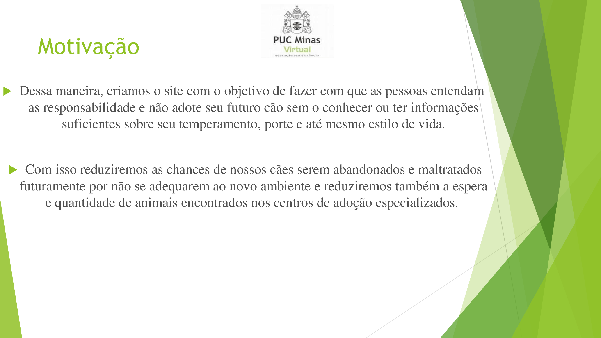
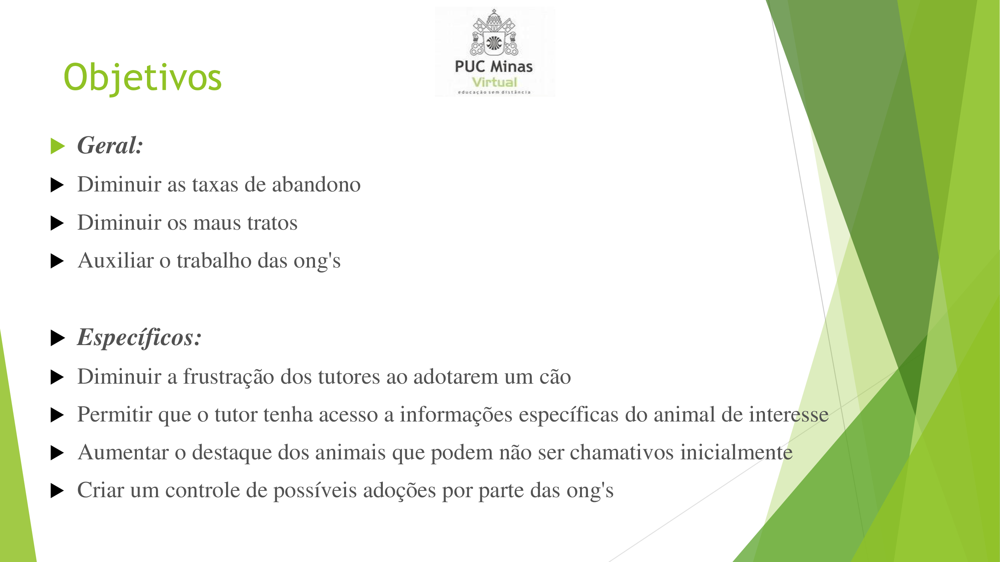
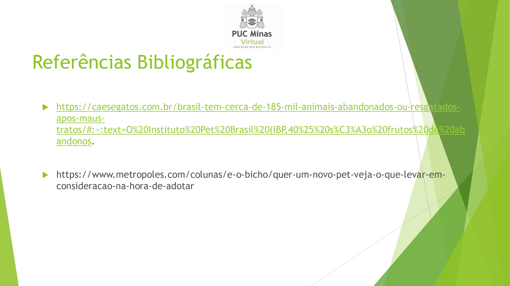
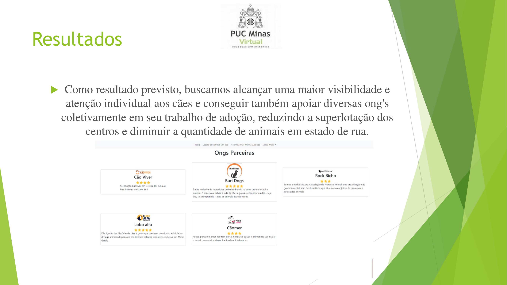

# Apresentação

Pré-requisitos: Todos os demais artefatos

<a href="../presentation/README.md"> Clique aqui para fazer os uploads dos arquivos de apresentação da solução.</a>

# Material de Apoio sobre a Apresentação de um Produto

## Título do Projeto

Nome e marca do projeto

## Identidade Visual (Marca, Design)

O grupo deve ter o cuidado em utilizar figuras, imagens, e cores dentro do contexto da solução proposta, de forma a manter a temática do problema.

> **Links Úteis**:
> - [10 dicas de design para slides](https://rockcontent.com/blog/design-para-slides/)
> - [7 dicas de design para criar apresentações de PowerPoint incríveis e eficientes](https://www.shutterstock.com/pt/blog/7-dicas-de-design-para-criar-apresentacoes-de-powerpoint-incriveis-e-eficientes)
> - [Especialista do TED dá 10 dicas para criar slides eficazes e bonitos](https://soap.com.br/blog/especialista-do-ted-da-10-dicas-para-criar-slides-eficazes-e-bonitos)

## Conjunto de Slides (Estrutura)

